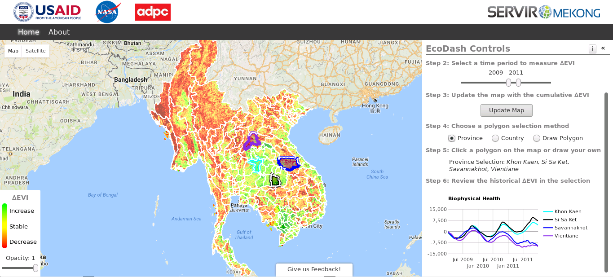

# EcoDash

A web application for the EVI change detection algorithm of SERVIR-Mekong using
Google Earth Engine and App Engine. The application itself can be found at
<a href="http://ecodash.appspot.com/">http://ecodash.appspot.com</a>. The Python
and JavaScript client libraries for calling the Earth Engine API can be found here:
<a href="https://github.com/google/earthengine-api/">https://github.com/google/earthengine-api</a>. More information about Google Earth Engine is listed here:
<a href="https://developers.google.com/earth-engine/">https://developers.google.com/earth-engine</a>.

## Installation

1. Clone this repository
2. Install Python 2.7
4. Install these Python libs: ee, httplib2, and oauth2client
3. Install the <a href="https://cloud.google.com/appengine/docs/python/download">Google Cloud SDK for Python</a>
5. Install Java Development Kit 1.8+
6. Install <a href="http://boot-clj.com/">Boot</a>

## Running

1. First, you need to build ecodash.js from the Clojurescript files in cljs:
   $ cd cljs
   $ boot prod

2. Now return to the toplevel directory and launch the Google App Engine development server:
   $ cd ..
   $ dev_appserver.py .

3. Your application is now live at: http://localhost:8080
